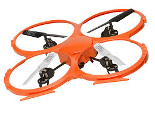

# Control of a 3D Quadrotor  
  
  
  
  
  
## Project Requirements:  

### A. Provide a Writeup / README that includes all the rubric points and how you addressed each one. You can submit your writeup as markdown or pdf.  

You're reading it!

---
### B. Implement Controller

The first thing I did was to test if the mass was correct by running the simulator through a basic rotor thrust command against gravity to see if the quadrotor would hover.  It fell to the ground because the mass parameter was too low.  I tweaked the mass until I got the quadrotor to approximately hover.  I rounded the mass to 0.50 and kept that as my mass parameter for all the scenarios.

All my chosen parameters are in the file  and they are also show at the end of the write up.

**_(1) Implement body rate control in C++._**  

I followed the lecture notes to update the formulas here.  THe parameter kpPQR I 

Within QuadControl::BodyRateControl:
    
    V3F Inertia = V3F(Ixx, Iyy, Izz);

    // output to Quadcopter
    momentCmd = Inertia * kpPQR * (pqrCmd - pqr);  

**_(2) Implement roll pitch control in C++._**  

Within QuadControl::RollPitchControl
 
    // Get inputs to roll-pitch controller from altitude controller convert thrust u1 (N) to m/s^2
    // from lateral controller
    float x_c_dot_dot = accelCmd.x;
    float y_c_dot_dot = accelCmd.y;

    // from quadcopter
    float b_x = R(0,2);       // roll angle phi
    float b_y = R(1,2);       // roll angle theta
    // float b_z = R(2, 2);   // roll angle psi   note calculated in yaw controller

    // set target p, q angles   note r is calculated by yaw controller
    float b_x_target = atan(x_c_dot_dot / collAccelCmd);   // p angle
    float b_y_target = atan(y_c_dot_dot / collAccelCmd);   // q angle
  
    b_x_target = CONSTRAIN(b_x_target, -maxTiltAngle, maxTiltAngle);
    b_y_target = CONSTRAIN(b_y_target, -maxTiltAngle, maxTiltAngle);

    float b_c_x_dot = kpBank * (b_x_target - b_x);   // pitch rate
    float b_c_y_dot = kpBank * (b_y_target - b_y);   // roll rate

    // convert coordinate frames
    pqrCmd.x = 1.0 / R(2,2) * (R(1,0) * b_c_x_dot - R(0,0) * b_c_y_dot);
    pqrCmd.y = 1.0 / R(2,2) * (R(1,1) * b_c_x_dot - R(0,1) * b_c_y_dot);

**_(3) Implement altitude controller in C++._**

Within QuadControl::AltitudeControl:
 
    float g = 9.81f;																	// gravitational force m/s^2
    float z = posZ;															      // z position
    float z_dot = velZ;														    // z velocity
    float z_Cmd = posZCmd;													  // z position command
    float z_dot_Cmd = CONSTRAIN(velZCmd, -maxAscentRate, maxDescentRate);     // z velocity command
    float z_dot_dot_Cmd = accelZCmd;									// z acceleration command
    float z_error = z_Cmd - z;												// z position error
    float z_dot_error = z_dot_Cmd - z_dot;						// z velocity error

    integratedAltitudeError += z_error * KiPosZ * dt;

    float P = (z_error * kpPosZ);
    float I = (z_dot_dot_Cmd + integratedAltitudeError);
    float D = (z_dot_error * kpVelZ);

    float z_dot_dot = P + I + D;

    thrust = (g - z_dot_dot) * mass / R(2,2);         // output to Roll-Pitch controller

**_(4) Implement lateral position control in C++._**  

Within QuadControl::LateralPositionControl:

    V3F pos_error = posCmd - pos;
    V3F vel_error = velCmd - vel;

    accelCmd.x = accelCmd.x + (pos_error.x * kpPosXY) + (vel_error.x * kpVelXY);
    accelCmd.y = accelCmd.y + (pos_error.y * kpPosXY) + (vel_error.y * kpVelXY);

    // outputs to Roll-Pitch controller
    accelCmd.x = CONSTRAIN(accelCmd.x, -maxAccelXY, maxAccelXY);
    accelCmd.y = CONSTRAIN(accelCmd.y, -maxAccelXY, maxAccelXY);
    
**_(5) Implement yaw control in C++._**  

Within QuadControl::YawControl
 
    float b = 2 * M_PI;
    yaw = fmodf(yaw, b);

    float yaw_error = yawCmd - yaw;

    // output to Body Rate controller
    yawRateCmd = (yaw_error * kpYaw);

**_(6) Implement calculating the motor commands given commanded thrust and moments in C++._**  

Within QuadControl::GenerateMotorCommands

    float l = L / M_SQRT2;					                   // perpendicular length to the axes
  
    float F = collThrustCmd;
    float Fx = momentCmd.x / l;
    float Fy = momentCmd.y / l;
    float Fz = momentCmd.z / kappa;

    float F1 = (F + Fx + Fy - Fz) / 4;
    float F2 = (F - Fx + Fy + Fz) / 4;
    float F3 = (F + Fx - Fy + Fz) / 4;
    float F4 = (F - Fx - Fy - Fz) / 4;
    float total_thrust = F1 + F2 + F3 + F4;

    assert(total_thrust = collThrustCmd);
    
    cmd.desiredThrustsN[0] = CONSTRAIN(F1, minMotorThrust, maxMotorThrust);
    cmd.desiredThrustsN[1] = CONSTRAIN(F2, minMotorThrust, maxMotorThrust);
    cmd.desiredThrustsN[2] = CONSTRAIN(F3, minMotorThrust, maxMotorThrust);
    cmd.desiredThrustsN[3] = CONSTRAIN(F4, minMotorThrust, maxMotorThrust);

---
**Notes:**

Parameters modified in *QuadControlParams.txt*  

    # Physical properties  
    Mass = 0.5

    # Position control gains  
    kpPosXY = 40
    kpPosZ = 55
    KiPosZ = 50

    # Velocity control gains  
    kpVelXY = 15
    kpVelZ = 15

    # Angle control gains
    kpBank = 12    
    kpYaw = 4     

    # Angle rate gains
    kpPQR = 40, 40, 10  

---
### C. Flight Evaluation  

**_Your C++ controller is successfully able to fly the provided test trajectory and visually passes inspection of the scenarios leading up to the test trajectory._**  

It does!

